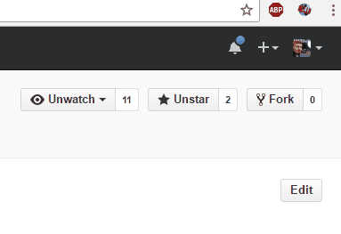

# Drone Build Button

_A Chrome Extension to push build hooks to Drone_

## Description

This extension will launch build hooks to a Drone server, simulating a perfectly working GitHub Enterprise server's own push hooks.
This is primarily useful for those who have infrastructure issues between GH and Drone, and need a way to force a build.

If only Drone had a "Build now" button...?

## Getting Started

1. Clone or download this repository and extra to a folder somewhere
2. Go to [`chrome://extensions`](chrome://extensions) and click `Developer mode`
3. Click `Load unpacked extension...` and choose the folder where you cloned or unzipped this repository
4. Click `Options` in the _Drone Build Button_ extension in the list
5. Enter a Personal Access Token with full `repo` permissions (this extension only _reads_, and will not change data)
6. Press save and close the extensions list

## Build a Commit

1. Browse to a commit page either in a Pull Request (`pulls/123/commit`) or directly
2. Click the extension button in the top right
3. Click `Build`
4. Send me beer

